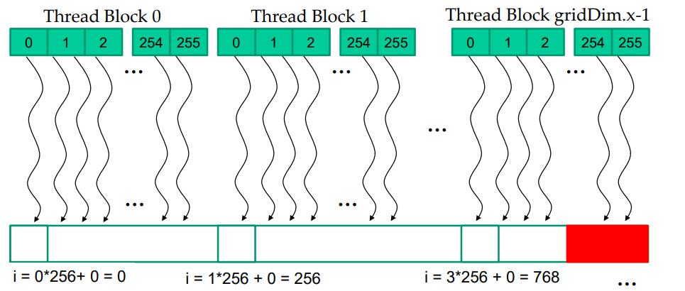
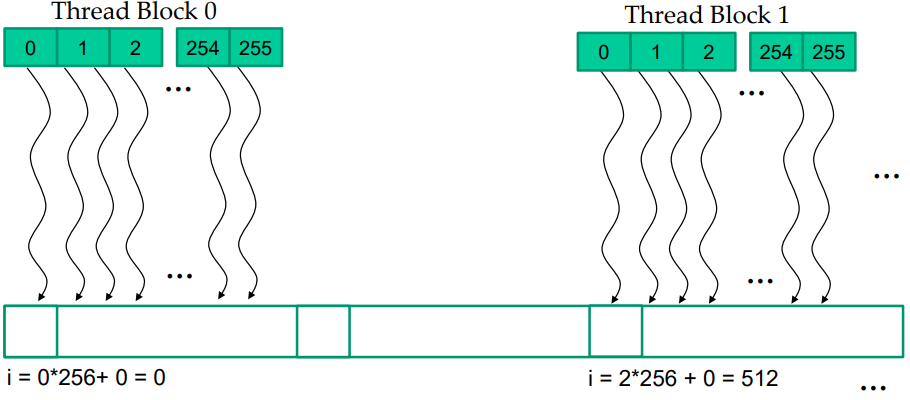
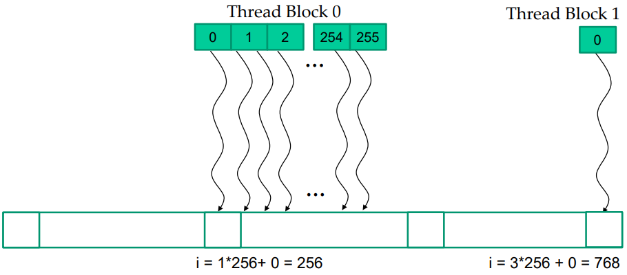

# Lecture3 Kernel-Based Data Parallel Execution Model

## Objective
* Muti-dimensional logical organization of CUDA threads
* Use control structures, such as loops in a kernel
* Concepts of thread scheduling, latency tolerance, and hardware occupancy

## Example 1 : 1D VecAdd 
**Thread Assgiment**

* N = 1000, block size = 256
* One element per thread





``` cpp
// one element per thread
__global__ void vecAdd(float *A, float* B, float* C, int n) {
    int i = blockIdx.x * blockDim.x + threadIdx.x;
    if (i < n)
        C[i] = A[i] + B[i];
}

dim3 dimGrid(std::ceil(n / 256), 1, 1);
dim3 dimBlock(256, 1, 1);

vecAdd<<<dimGrid, dimBlock>>>(A, B, C, n); // device variables
```
 
**Coarser grains : two elements per thread**

 


``` cpp
// Coarser Grains : two element per thread
int i = blockIdx.x * (2 * blockDim.x) + threadIdx.x;
if (i < n)
    C[i] = A[i] + B[i];
i += blockDim.x;
if (i < n)
    C[i] = A[i] + B[i];
    
```
## Example 2 : Color Image to gray Image
Convert color image to a gray-scale image


Row-major layout of 2D arrays in C/C++


### RGBtoGrayImage Kernel

``` cpp
// RGB2gray
__global__ void RGB2gray(unsigned char* grayImage, unsigned char* rgbImage, int Width, int Height) {
    int Col = blockIdx.x * blockDim.x + threaIdx.x;
    int Row = blockIdx.y * blockDim.y + threaIdx.y;
    
    if (Row < Height && Col < Width) {
        int grayOffset = Row * Width + Col;
        
        int rgbOffset = 3 * grayoffset;
        unsigned char r = rgbImage[rgbOffset];
        unsigned char g = rgbImage[rgbOffset + 1];
        unsigned char b = rgbImage[rgbOffset + 2];
        
        grayImage[grayOffset] = 0.21f * r + 0.71f * g + 0.07f * b;
    }
}

``` 

## Example 3 : Image Blurring
Each output is the average of pixels around it (BLUR_SIZE = 1)

### Image Blur Kernel
``` cpp
// Imgae Blur
#define BLUR_SIZE 1
__global__ void(unsigned char* in, unsigned char* out, int width, int height) {
    int col = blockIdx.x * blockDim.x + threaIdx.x;
    int row = blockIdx.y * blockDim.y + threaIdx.y;
    
    if (row < height && col < width) {
        int pixVal = 0;
        int pixels = 0;
        
        // Get the average of the surrounding BLUR_SIZE x BLUR_SIZE box
        for (int blurRow = - BLUR_SIZE; i <= BLUR_SIZE; blurRow++) {
            for (int blurCol = - BLUR_SIZE; i <= BLUR_SIZE; blurCol++) {
                int curRow = row + blurRow;
                int curCol = col + blurCol;
                
                // Verify we have a valid image pixel
                if (curRow >= 0 && curRow < height && curCol >= 0 && curCol < Width) {
                    pixVal += in[curRow * Width + curCol];
                    pixels++;
                } 
            }
        }
    }
}
```